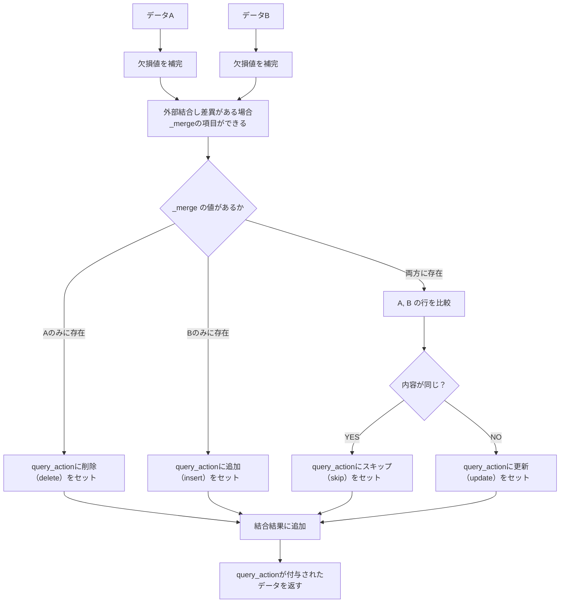

# generate_diff_dataframe

## Overview

pandasを使ってデータの差分をチェックする

## Badge

## 処理フロー

```mermaid
flowchart TD
    A1[データA] --> B1[欠損値を補完]
    A2[データB] --> B2[欠損値を補完]
    B1 --> C[外部結合し差異がある場合_mergeの項目ができる]
    B2 --> C
    C --> D{_merge の値があるか}

    D --Aのみに存在--> F1["query_actionに削除（delete）"をセット]
    D --Bのみに存在--> F2["query_actionに追加（insert）"をセット]

    D --両方に存在--> F3[A, B の行を比較]
    F3 --> G{内容が同じ？}
    G --YES--> H1["query_actionにスキップ（skip）"をセット]
    G --NO--> H2["query_actionに更新（update）"をセット]

    F1 --> J[結合結果に追加]
    F2 --> J
    H1 --> J
    H2 --> J

    J --> K[query_actionが付与されたデータを返す]
```
